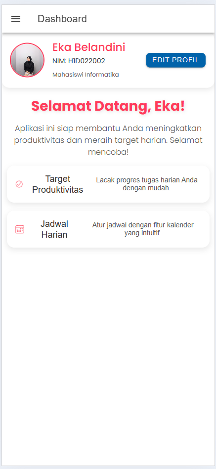

# Tugas 6 - Pertemuan 7

**Nama**  : Eka Belandini  
**NIM**   : H1D022002  
**Shift** : F

## Deskripsi Proyek

Proyek ini merupakan pengembangan aplikasi mobile sederhana menggunakan framework Ionic. Aplikasi ini dilengkapi dengan berbagai komponen interaktif yang meningkatkan pengalaman pengguna. Dalam proyek ini, saya menambahkan komponen Ionic pada halaman utama yang menampilkan informasi pengguna, seperti nama dan NIM, dengan gaya yang menarik dan fungsional.

## Penjelasan Komponen yang Ditambahkan

1. **Profile Section**: Menampilkan avatar pengguna dan informasi dasar.
2. **Welcome Message**: Menyambut pengguna dengan pesan yang ramah.
3. **Feature Cards**: Kartu yang menjelaskan fitur aplikasi dengan ikon dan deskripsi.


## Penjelasan File dan Struktur Kode
### Penjelasan File

- **app.component.ts**: Berisi logika dan pengaturan utama aplikasi Ionic.
- **home.page.ts**: Halaman utama yang menampilkan komponen yang telah ditambahkan.
- **home.page.html**: Template untuk halaman utama yang mencakup markup HTML untuk komponen yang ditambahkan.
- **about.page.ts**: Halaman yang berisi informasi tambahan tentang aplikasi.
- **about.page.html**: Template untuk halaman About.

### Penjelasan Struktur Kode
#### 1. **app.component.ts**
   - **`@Component`**: Menentukan metadata untuk komponen utama aplikasi.
   - **`initializeApp()`**: Fungsi yang dipanggil saat aplikasi dimulai, memuat pengaturan awal.

#### 2. **home.page.ts**
   - **`constructor()`**: Menginisialisasi variabel yang akan digunakan di halaman utama.
   - **`ngOnInit()`**: Lifecycle hook untuk memuat data saat halaman diinisialisasi.
   - **`userName`**: Variabel untuk menyimpan nama pengguna yang ditampilkan di halaman.

#### 3. **home.page.html**
   - **`<ion-header>`**: Bagian atas halaman yang berisi judul aplikasi.
   - **`<ion-content>`**: Konten utama halaman yang berisi komponen yang ditambahkan.
   - **`<ion-card>`**: Digunakan untuk menampilkan informasi pengguna, termasuk nama dan NIM.
   - **`<ion-button>`**: Tombol interaktif yang bisa di-click, memberikan feedback kepada pengguna.

#### 4. **about.page.ts**
   - **`@Component`**: Menentukan metadata untuk halaman About.
   - **`ngOnInit()`**: Memuat informasi yang akan ditampilkan di halaman About.

#### 5. **about.page.html**
   - **`<ion-header>`**: Header untuk halaman About.
   - **`<ion-content>`**: Konten yang menjelaskan aplikasi dan tujuan pengembangannya.


## Demo Aplikasi

Berikut adalah beberapa screenshot dari aplikasi yang menunjukkan tampilan dan fitur yang ada:

### Screenshot Halaman Utama


## Cara Menjalankan Aplikasi

1. **Instalasi Ionic**: Pastikan Anda sudah menginstal Ionic di komputer Anda. Jika belum, ikuti petunjuk di [dokumentasi resmi Ionic](https://ionicframework.com/docs/intro).
2. **Clone Repository**: Clone repository ini dengan perintah berikut:
   ```bash
   git clone <URL_REPOSITORY>
   ```
3. **Instalasi Dependensi**: Masuk ke direktori proyek dan instal dependensi dengan perintah:
   ```bash
   npm install
   ```
4. **Jalankan Aplikasi**: Untuk menjalankan aplikasi di browser, gunakan perintah:
   ```bash
   ionic serve
   ```

## Menambahkan Komponen di Halaman Ionic

Untuk menambahkan komponen di halaman Ionic, ikuti langkah-langkah berikut:

1. **Pilih Komponen**: Kunjungi [daftar komponen Ionic](https://ionicframework.com/docs/components) dan pilih komponen yang ingin Anda tambahkan.
   
2. **Impor Komponen**: Jika komponen tersebut memerlukan modul tertentu, impor modul tersebut ke dalam file `app.module.ts`.

   Contoh untuk mengimpor `IonicModule`:
   ```typescript
   import { IonicModule } from '@ionic/angular';

   @NgModule({
     declarations: [...],
     imports: [
       IonicModule.forRoot(),
       ...
     ],
     providers: [...],
     bootstrap: [...]
   })
   export class AppModule {}
   ```

3. **Tambahkan Komponen ke Template**: Edit file template HTML (misalnya, `home.page.html`) untuk menambahkan markup komponen yang diinginkan.

   Contoh menambahkan `ion-card`:
   ```html
   <ion-card>
     <ion-card-header>
       <ion-card-title>Nama: Eka Belandini</ion-card-title>
       <ion-card-subtitle>NIM: H1D022002</ion-card-subtitle>
     </ion-card-header>
   </ion-card>
   ```

4. **Stilisasi Komponen**: Jika diperlukan, Anda dapat menambahkan CSS untuk mengubah gaya komponen sesuai dengan tema aplikasi Anda.

5. **Jalankan Aplikasi**: Setelah semua komponen ditambahkan dan disesuaikan, jalankan aplikasi untuk melihat hasilnya.
